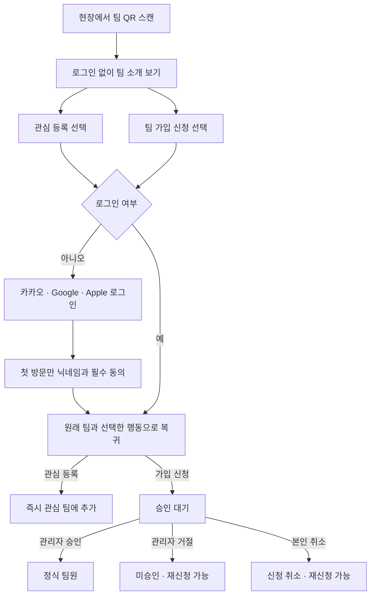
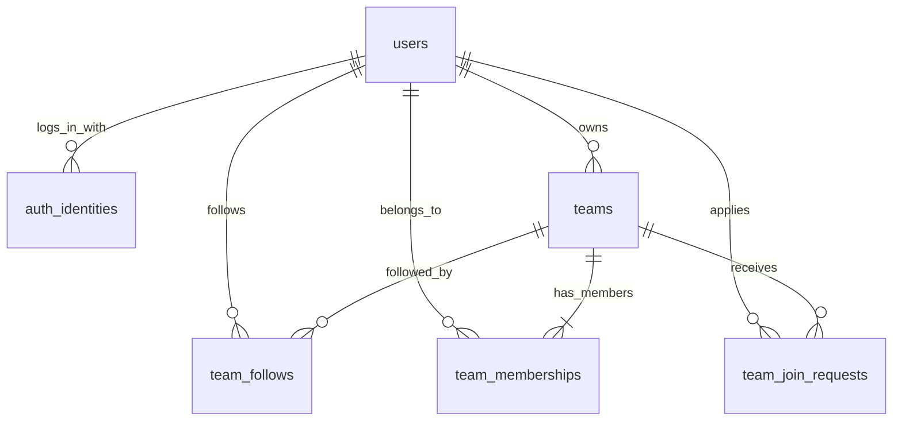

# Mefoot 회원·팀·가입 승인 설계 v1

2026-09-15 작성. 사용자가 정한 **관심 등록 즉시 반영 / 정식 가입은 관리자 승인**을 기준으로 한다. 기존 `/t/` 팀 진입 경로를 유지한다. 운영 DB에 정식 마이그레이션 001·002를 적용했고 인증·팀 API 코드와 실제 DB 통합 검증을 완료했다. 원격 API/Worker 배포와 소셜 제공자 로그인·가입 화면은 아직 완료 전이다. 구현된 요청과 설정은 [API 문서](api.md)에 정리한다.

## 사용자에게 보이는 흐름

QR을 스캔하거나 로그인만 했다는 이유로 관심·신청을 만들지 않는다. 사용자가 누른 행동을 이어 간다. 로그인 완료 시 팀 상태를 다시 확인하고, 동작은 POST/PUT로 한 번만 반영한다. 첫 회원가입에 필요한 정보는 닉네임과 필수 동의로 최소화한다. 이메일·프로필 이미지는 선택 사항이며 전화번호·생년월일·주소는 지금 수집하지 않는다.

## 이번에 사용하는 기본 정책

| 항목 | 결정 |
| --- | --- |
| 팀 수 | 한 회원이 여러 팀에 관심 등록·가입 가능 |
| 팀 생성 | 활동 가능한 로그인 회원이 생성; 생성자가 대표이자 최초 팀원 |
| 역할 | 대표 1명, 운영진 여러 명, 일반 팀원 |
| 관심과 가입 | 서로 독립. 가입 신청·승인이 관심 등록을 자동 변경하지 않음 |
| 신청 중복 | 한 사람·한 팀의 대기 신청은 최대 1건 |
| 재신청 | 거절·취소 후 새 신청으로 가능; 이미 끝난 신청을 재사용하지 않음 |
| 현재 팀원 | 같은 팀에 다시 신청할 수 없음 |
| 대표 탈퇴 | 다른 현재 팀원에게 대표를 이관한 후 가능 |
| 팀 이름·닉네임 | 중복 허용. 내부 UUID로 구분 |
| 소셜 연결 | 제공자별 로그인 1개씩 연결 가능. 이메일이 같아도 자동 통합하지 않음 |

위 기본 정책은 변경 가능한 제품 결정이다. 경기 용병 참가 신청은 팀 가입과 다른 기능이며 이번 모델에 섞지 않는다. 거절이 영구 차단을 의미하지는 않는다. 운영상 차단 기능이 필요해지면 별도로 추가한다.

## 도메인 데이터 구조: 6개 테이블

| 테이블 | 의미 | 주요 데이터 |
| --- | --- | --- |
| `users` | Mefoot 회원 한 명 | 내부 ID, 닉네임, 이미지, 활동 상태, 최초 필수 동의 버전·시간 |
| `auth_identities` | 회원의 로그인 수단 | 회원 ID, 제공자, 제공자 사용자 식별자, 선택 이메일·확인 여부 |
| `teams` | 팀의 공개 소개와 대표 | 팀 ID, 이름, 종목, 활동 지역 표시, 소개, 대표 ID, 신규 신청 허용 여부 |
| `team_follows` | 관심 등록 | 회원 ID + 팀 ID, 등록 시각 |
| `team_memberships` | 현재 정식 팀원 | 회원 ID + 팀 ID, 역할(`member`/`admin`), 현재 가입 시각 |
| `team_join_requests` | 가입 신청과 처리 이력 | 신청 ID, 회원·팀 ID, 상태, 가입 인사, 처리자·시각·사유 |

대표는 `teams.owner_user_id` 한 곳에서 판정한다. `team_memberships.role`에 별도 `owner` 값을 저장하지 않아 두 곳의 정보가 달라지는 것을 막는다. 대표의 멤버십 역할 값이 `member`여도 대표 권한이 우선한다. 이관 시 이전 대표는 저장된 역할로 돌아가며 UI에서 결과를 보여 준다.

`team_memberships`는 현재 상태, `team_join_requests`는 과거 이력이다. 승인 후 탈퇴하면 현재 팀원 행만 없어지고 과거 승인은 남는다. 다시 가입하면 새 신청과 새 가입 시각을 사용한다. 탈퇴·권한 변경의 상세 감사 이력은 이번 6개 테이블에 포함하지 않는다.

인증 구현에서는 `oauth_flows`(로그인 시도), `auth_registrations`(제공자 인증 후 회원가입 대기), `sessions`(로그인 세션)를 추가했다. 현재 서비스 테이블은 총 9개이며, 별도 `schema_migrations`가 적용 파일의 이름·체크섬·시각을 기록한다.

## 신청 상태와 화면 표시

| 현재 상태 | 누가 무엇을 할 수 있는가 | 결과 |
| --- | --- | --- |
| `pending` | 대표·운영진 승인 | `approved`와 팀원 추가를 같은 트랜잭션에서 처리 |
| `pending` | 대표·운영진 거절 | `rejected`; 처리자·시각 저장 |
| `pending` | 신청자 취소 | `withdrawn`; 신청자가 처리자 |
| `approved/rejected/withdrawn` | 상태 변경 불가 | 다시 신청하려면 별도의 새 신청 |

팀 화면은 **현재 팀원 → 대기 신청 → 관심 여부** 순서로 표시한다. 과거 `approved` 기록만 보고 지금도 팀원이라고 표시하면 안 된다. 승인 대기자에게 팀원 전용 정보나 관리 버튼을 노출하지 않는다. 거절 사유를 저장하면 신청자에게 보여 주는 사유로 취급한다; 내부 평가 메모로 사용하지 않는다.

## 권한

| 행동 | 허용 대상 |
| --- | --- |
| 팀 소개·QR 보기 | 누구나. 회원 명단·연락처·가입 신청 내용은 공개 응답에서 제외 |
| 관심 등록·해제 | 활동 가능한 로그인 회원 본인 |
| 가입 신청·신청 취소 | 활동 가능한 로그인 회원 본인 |
| 내 신청 결과 보기 | 신청자 본인 |
| 가입 대기 목록·승인·거절 | 해당 팀의 활동 가능한 대표·운영진 |
| 팀 소개 수정·QR 이미지 생성 | 해당 팀의 대표·운영진 |
| 운영진 임명·해제·대표 이관 | 해당 팀 대표 |
| 탈퇴 | 본인. 현재 대표는 이관 선행 |

서버는 세션에서 실제 회원 ID를 구한다. 클라이언트가 보낸 `user_id`, `resolved_by_user_id`, `role`, `status`를 그대로 저장하지 않는다. 정지·탈퇴 회원의 모든 변경 요청을 차단한다. 팀 가입이 열려 있어도 보관된 팀에는 신청·승인을 허용하지 않는다. `join_requests_open=false`는 새 신청만 막고, 이미 접수한 신청의 처리는 허용한다.

DB 계정 `mefoot_dev`는 개발·마이그레이션용이다. 브라우저·PWA에 DB 자격 증명을 넣지 않는다. API는 서버 전용 `mefoot_app` 계정으로 접근하며 서비스 데이터 DML만 허용한다. 앱 역할의 스키마 CREATE와 마이그레이션 이력 SELECT가 거부되고 TLS 1.3으로 접속하는 것을 확인했다. RLS는 사용하지 않으며 회원·팀 권한 검사는 API에서 수행하고, 상태·중복·관계 제약은 DB가 검사한다.

대표 FK는 대표의 팀원 행 존재를 검사한다. 회원의 `status`를 `withdrawn`으로 바꾸는 것까지 차단하지 않으므로, 계정 탈퇴 API도 대표 이관 여부를 별도로 확인해야 한다.

## 소셜 로그인 식별과 QR 복귀

Mefoot 회원 ID와 소셜 제공자 ID를 분리한다. Google·Apple은 검증된 `sub`, 카카오는 검증된 회원 식별자를 **문자열**로 보관한다. 카카오의 큰 숫자 ID를 JavaScript `Number`로 변환하다 정밀도를 잃지 않게 한다. 제공자·식별자 쌍은 유일하며, 한 회원이 다른 제공자를 추가 연결해도 기존 팀과 신청은 그대로 유지된다.

이메일은 변경·미제공·중계 주소가 가능하므로 계정 연결 키로 사용하지 않는다. 추가 연결은 현재 계정 로그인과 새 소셜 인증을 모두 확인한 후 수행한다. 이미 다른 Mefoot 회원에게 연결된 식별자는 자동 이동하지 않는다. 현재 설계는 서비스당 하나의 카카오 앱과 일관된 Apple 식별자 범위를 전제로 한다. 앱 이전이나 서로 다른 제공자 앱을 합치는 작업은 별도 마이그레이션이다. [Google 식별자 안내](https://developers.google.com/identity/openid-connect/openid-connect), [카카오 사용자 정보](https://developers.kakao.com/docs/ko/kakaologin/rest-api).

QR 값은 `${APP_ORIGIN}/t/{team_id}`다. 공개 안내 링크이므로 관리자 권한, 승인 토큰, 비밀번호를 넣지 않는다. QR 이미지는 이 URL에서 바로 만들 수 있어 발급 이력 테이블이 필요 없다. 이미 인쇄한 QR은 팀 이름을 바꿔도 유효하다. 서비스 도메인은 `APP_ORIGIN` 설정에서 결정한다.

로그인 전 선택한 `team_id`와 `intent=view|follow|join`은 10분 만료되는 `oauth_flows`에 묶는다. OAuth state/nonce와 브라우저 쿠키의 연결을 검증하며 시도 정보는 한 번만 사용한다. 최초 가입 대기는 15분, 일반 로그인 세션은 기본 14일이다. 외부 임의 URL로 리디렉션하지 않고 로그인·가입 응답으로 원래 팀 경로를 돌려준다. 로그인 자체가 관심 등록이나 팀 가입 신청을 만들지는 않는다. 화면은 복귀 후 최신 팀 상태를 확인하고 사용자가 선택한 요청을 수행해야 하며, 해당 가입 화면은 아직 구현 전이다.

## 중복 요청과 동시 승인 처리 계약

단순 상태 값 검사만으로 관리자 권한과 경쟁 상황을 해결할 수는 없다. 팀원·신청·역할·대표·팀 신청 설정을 바꾸는 API는 **같은 팀 행을 먼저 잠그는 규칙**을 공통으로 사용한다. MVP의 팀 단위 짧은 트랜잭션으로 충분하며 전역 잠금은 사용하지 않는다.

승인 API의 처리 순서는 다음과 같다.

1. 트랜잭션을 시작하고 URL의 팀 행을 `SELECT ... FOR UPDATE`로 잠근다.
2. 실제 세션 회원이 활동 중이며 해당 팀 대표 또는 운영진인지 확인한다. 보관된 팀은 거절한다.
3. 요청 ID가 이 팀의 신청인지 확인하고 해당 신청 행을 잠근다. 다른 팀의 요청 ID는 처리하지 않는다.
4. 신청자 활동 상태·대기 상태·현재 멤버십을 다시 확인한다.
5. 현재 팀원 행을 `member`로 추가하고, 신청을 `approved` 및 처리자·시각으로 갱신한다.
6. 둘 다 성공해야 커밋한다. 실패하면 모두 롤백한다.

운영진 두 명이 동시에 누르거나 신청 취소와 승인이 겹쳐도 팀 행 잠금 이후 최신 상태로 한 요청만 처리한다. 권한 변경과 탈퇴도 같은 잠금 순서를 사용해야 한다. 계정 전체 정지·탈퇴 처리는 해당 회원 행의 잠금도 사용하고, 팀 변경에서는 팀 잠금 이후 관련 회원 행을 UUID 순으로 잠근다. 여러 팀을 처리하는 관리 작업은 팀 ID 순서로 먼저 잠가 잠금 순환을 피한다. 네트워크 호출·푸시 발송은 DB 트랜잭션 안에서 하지 않는다. 알림 보장은 별도의 발송 큐 구현 때 다룬다.

| 반복 호출 | 응답 원칙 |
| --- | --- |
| 같은 관심 등록 | `INSERT ... ON CONFLICT DO NOTHING`; 이미 관심 상태여도 성공 |
| 같은 관심 해제 | 행이 없어도 성공 |
| 이미 대기 중인데 신청 | 기존 대기 신청을 반환 |
| 이미 팀원인데 신청 | 현재 멤버십 반환; 새 신청을 만들지 않음 |
| 같은 요청의 동일 승인·거절·취소 재전송 | 권한 재확인 후 기존 완료 결과 반환 |
| 이미 끝난 요청을 반대 결과로 처리 | `409 request_already_resolved` |

거절·취소 후 새 신청에는 클라이언트가 새 UUID `request_id`를 만든다. 네트워크 재시도에는 같은 UUID를 사용한다. 이전 요청 ID를 재사용하면 새 신청을 만들지 않고 기존 결과를 반환한다. 서버는 그 ID의 소유 회원·팀도 비교한다. 기본 UUID 생성값은 관리·마이그레이션 용도이며 API는 멱등성에 사용하는 요청 ID를 명시한다.

## DB와 API의 책임

| 적용된 DB에서 보장 | API 코드에서 구현·검증 |
| --- | --- |
| 제공자 식별자 중복 금지 | ID 토큰 서명·issuer·audience·nonce 검증, 세션 관리 |
| 관심·현재 팀원 중복 금지 | 본인 요청 확인, 데이터 공개 범위 |
| 대기 신청 1건 | 현재 팀원 재신청 차단, 팀 상태 확인 |
| 처리자·시각 필수, 자기 승인 금지 | 처리 시점의 운영진 권한 확인 |
| 새 신청은 pending, 종결 상태 재개 금지 | 승인과 팀원 추가의 원자성, 요청 재시도 처리 |
| 대표가 현재 팀원이어야 함(커밋 시 검사) | 대표 이관 권한, 관련 API의 동일 잠금 순서 |

대표 FK를 지연 검사하므로 팀 생성은 `teams INSERT → 대표 team_memberships INSERT → COMMIT` 한 트랜잭션으로 진행한다. 이관도 대표 ID 변경과 필요한 회원 상태 변경을 한 트랜잭션에 묶는다. [PostgreSQL 제약](https://www.postgresql.org/docs/18/ddl-constraints.html), [행 잠금](https://www.postgresql.org/docs/18/explicit-locking.html).

## 적용 범위와 검증

- 적용된 SQL: [001_members_teams.sql](../database/migrations/001_members_teams.sql), [002_auth_sessions.sql](../database/migrations/002_auth_sessions.sql)
- 제약 검증 SQL: [001_members_teams.sql](../database/tests/001_members_teams.sql)
- 현재 운영 DB: PostgreSQL 18.6, `mefoot` 스키마의 서비스 테이블 9개와 적용 이력 테이블 1개. 마이그레이션 실행기가 트랜잭션과 SHA-256 이력을 관리한다.
- 최초 초안의 제약 검사 25개를 실제 DB에서 통과한 뒤 되돌렸으며, 이후 정식 마이그레이션 001·002를 운영에 영구 적용했다. 적용된 파일은 수정하지 않고 다음 마이그레이션을 추가한다.
- 현재 단위 검사 53개를 통과했다. 실제 `mefoot_app` 계정으로 세션·권한 경계·동시 승인·승인/취소 경합·대표 이관·일회용 OAuth 및 가입 토큰을 검증했고 테스트 데이터 정리도 확인했다.
- Worker 게이트웨이와 API 코드는 작성됐지만 원격 API 이미지/Worker 배포는 아직 확인 전이다. 실제 OAuth 키·게시한 약관·가입 UI가 없어 제공자 로그인은 비활성 상태다. 제공자 인증 화면까지 통과한 것으로 간주하지 않는다.

최초 필수 동의 버전·시각만 이번 회원 행에 넣었다. 약관 갱신 동의 이력, 마케팅 동의, 회원 탈퇴 시 개인정보 삭제·이력 보관, 팀 폐쇄와 강제 탈퇴 정책은 실제 공개 전에 추가 설계한다. FK가 과거 처리자를 보존하므로 회원 행을 무조건 삭제하는 방식으로 탈퇴를 구현하지 않는다. 이력 영구 보관을 결정한 것은 아니다.
